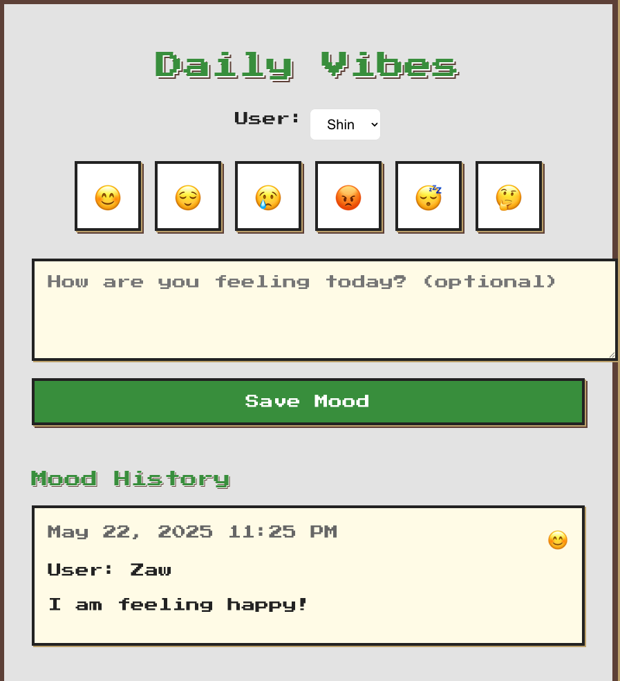

# Daily Vibes

A simple, modern web app for tracking your daily mood with emojis and notes. Built with React and Vite, supporting multiple users and persistent mood history.

## Features
- Select your mood from a list of emojis
- Optionally write a short note about your day
- Choose your user (can be defined by anyone)
- View a history of all mood entries, including date, note, and user
- Mood history is saved in your browser (localStorage)
- Responsive, clean, and light UI

## Live Demo
Once deployed, your app will be available at your deployment URL. This demo is deployed on GitLab.

## Getting Started

### Prerequisites
- Node.js (v18 or later recommended)
- npm

### Installation
1. Clone the repository:
   ```sh
   git clone https://github.com/jamesleocodes/hobby_apps.git
   cd daily-vibes
   ```
2. Install dependencies:
   ```sh
   npm install
   ```
3. Start the development server:
   ```sh
   npm run dev
   ```
4. Open [http://localhost:5173](http://localhost:5173) in your browser.

### Running on GitLab
1. Ensure your project is set up on GitLab.
2. Configure your `.gitlab-ci.yml` file as shown in the Deployment section.
3. Push your changes to GitLab:
   ```sh
   git add .
   git commit -m "Deploy to GitLab Pages"
   git push
   ```
4. Check the pipeline status in the GitLab CI/CD section of your project.
5. Wait for the pipeline to finish, then visit your deployment URL.

## Usage
- Select your user from the dropdown at the top.
- Click an emoji to select your mood.
- Optionally, write a note about your day.
- Click "Save Mood" to add your entry to the history.
- Your mood history will appear below, showing the date, mood, note, and user.
- All data is saved in your browser and will persist after refresh.

## Deployment (GitLab Pages)
1. Ensure your `vite.config.ts` has:
   ```js
   export default defineConfig({
     plugins: [react()],
     base: '/',
   })
   ```
2. Ensure your `.gitlab-ci.yml` includes:
   ```yaml
   image: node:18

   pages:
     script:
       - npm ci
       - npm run build
       - touch dist/.nojekyll
       - mv dist public
     artifacts:
       paths:
         - public
     only:
       - main
   ```
3. Commit and push your changes:
   ```sh
   git add .
   git commit -m "Deploy to GitLab Pages"
   git push
   ```
4. Wait for the pipeline to finish, then visit your deployment URL.

## Contributing
Pull requests and suggestions are welcome!

## License
This project is licensed under the MIT License - see the [LICENSE](LICENSE) file for details.


